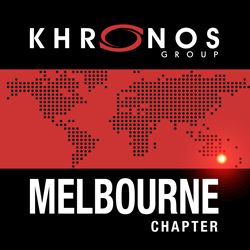

# [Khronos Melbourne Chapter](https://khronos-melbourne-chapter.github.io)

## About the chapter

Melbourne has an active and vibrant creative and technical enthusiast community in many fields using Khronos open standards. The chapter aims to serve anyone interested in using these technology standards for greater good, and is an opportune venue to meet like-minded individuals. The Khronos Group offers much support for every developer and creator community, including Melbourne.

 * **Slack:** khronos-mel.slack.com ([join link](https://join.slack.com/t/khronos-mel/shared_invite/enQtMzQzOTY4ODcwOTI4LTIwYWM2Mjg0ZjQyOGRmYTgyMGFlNjFlODdlZDQ2YTg4MWE3ZDI5YmY1OTBkY2RjMTI2ZDcwNmMwZjcyOTBhZTQ))
 * **Twitter:** https://twitter.com/KhronosMEL

## Upcoming events

### Khronos Melbourne Social Night

Where: [**Pilgrim Bar**](http://www.pilgrimbar.com.au/) ([map](https://goo.gl/maps/cU1b2XVSBGq))

When: Every last Thursday of the month 
**6:00 PM to 7:30 PM, Thurday 26th April, 2018**

## What to expect

 * Show your laptop, phone, or anything you are working on. It might be a game, technology, or a weird experiment.
 * Share the latest news with fellow graphics enthusiasts, over a beverage of your choice.
 * Bring a respectful and inclusive mindset to the meetup.

## Suggest an idea

Post a new [Github issue](https://github.com/khronos-melbourne-chapter/khronos-melbourne-chapter.github.io/issues) and begin a discussion. :)

## Code of Conduct

From the [Khronos Code of Conduct](https://www.khronos.org/news/events/code-of-conduct) (read full in link):

> The Khronos Group strives to provide an open, friendly, inclusive environment. We are dedicated to providing a harassment-free experience for everyone, regardless of nationality, gender, gender identity and expression, sexual orientation, disability, physical appearance, body size, race, age or religion.

> If someone makes you or anyone else feel unsafe or unwelcome, please report it as soon as possible. Harassment and other code of conduct violations reduce the value of our event for everyone. We want you to be happy at our event. People like you make our event a better place.

> You can make a report personally to Xavier (contact@xavierho.com).

## Organisers

Xavier Ho (contact@xavierho.com)
 - Looking for more co-organisers

## Subscribe to updates

[Watch this repository with your GitHub account](https://github.com/khronos-melbourne-chapter/khronos-melbourne-chapter.github.io/subscription).

You can also watch our [Twitter](https://twitter.com/KhronosMEL), or join our [Slack channel](khronos-mel.slack.com).

